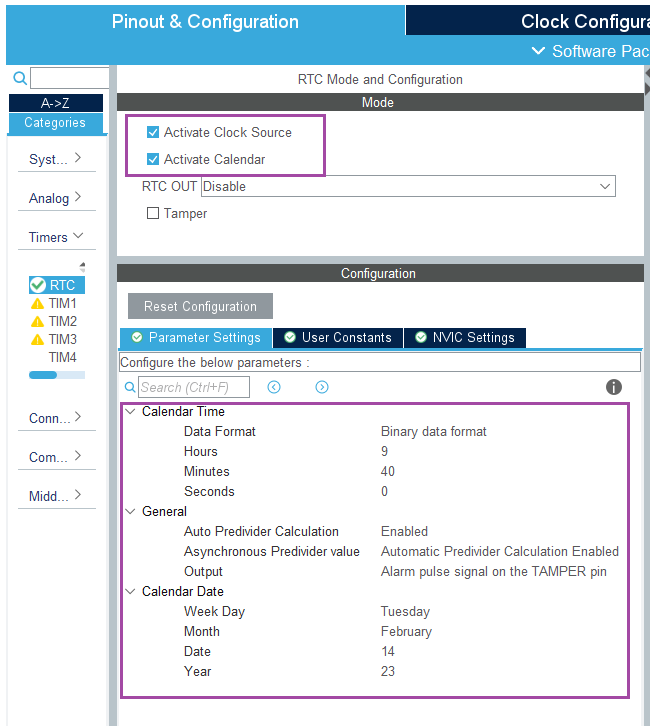

# STM32F103_RTC_and_EXTI
In this project, External Interrupt and RTC application was made.
In addition, time counting was done with Systick timer in the project.

Pinout & Configuration and Clock Configuration are as in the images below.

